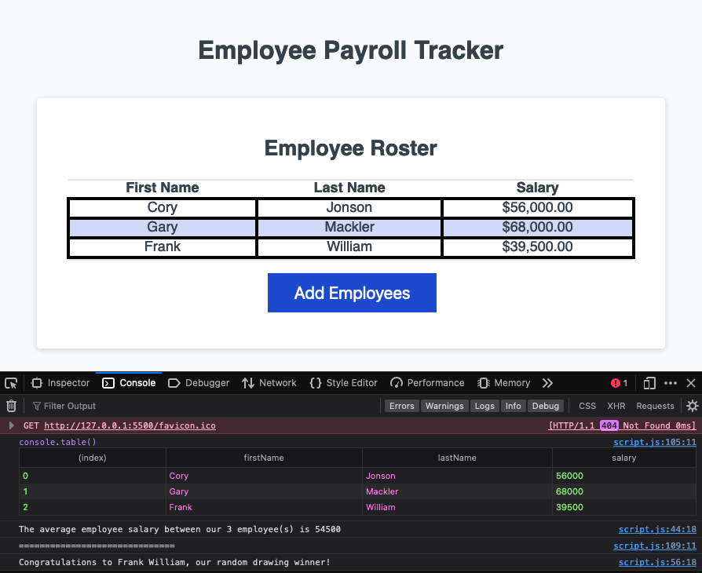

# C3-Employee-Payroll-Tracker

## Project Description

Payroll management application with responsive UI to view and manage payroll data, powered by JavaScript, HTML, and CSS.

## Features

- **Collect Employee Data:** Prompts the user to enter in employee details (First Name, Last Name, Salary).
- **Sort Employees:** Sorts the list of provided employees by last name.
- **Display Average Salary:** Calculates an average salary of provided employees and displays them in the console.
- **Select Random Employee:** Randomly selects an employee from the entered array.

## Deployed Page

[Deployed GitHub Page]()

## Source Code

- Base code provided by: [The Coding Bootcamp](https://github.com/coding-boot-camp/curly-potato)
- Modifications by [Lixiviate](https://github.com/Lixiviate)
